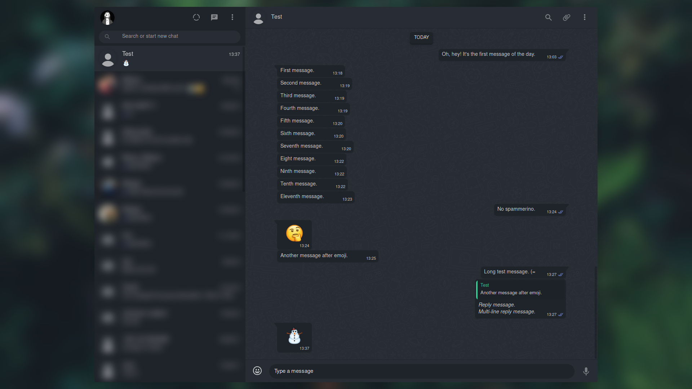

# onyx

Complete, feature-rich, very customizable userstyle for WhatsApp.

## Features

* Whole UI is styled to match the overall theme
* Customizable colors, wide variety of light and dark color-schemes supported
* Compact mode for small resolutions since there is no official support for it yet
* Fullscreen mode, if you prefer using the app without wasted space
* Private mode where contact list and/or images are blurred until you hover over them
* Light/dark/no chat area doodles
* Enable/disable message tails
* Custom background images
* Custom emoji opacity
* Custom compact mode breakpoint and ability to disable it
* Custom CSS so you can overwrite mine and not worry about future updates

## Preview

Version 1.3.0 with default settings.

## Install

To use this style you have to install [Stylus](https://add0n.com/stylus.html) and then click on the button below.

[![Install directly with Stylus][badge]][style]

[badge]: https://img.shields.io/badge/Install%20directly%20with-Stylus-116b59.svg?longCache=true&style=for-the-badge
[style]: https://raw.githubusercontent.com/vednoc/onyx/master/WhatsApp.user.css

**NOTE:** _Stylish_ is only supported through [userstyles.org](https://userstyles.org/styles/142096); it's obsolete, please replace it with Stylus.

### Using with Franz

A port of this theme is available in the [dcferreira/franz-themes](https://github.com/dcferreira/franz-themes) repository.

## Contribute

Any sort of contribution is more than welcome. If you'd like to tip me then you can buy me a [ko-fi](https://ko-fi.com/vednoc).

If you have an idea to share, a question to ask or a problem to report then do feel free to message me or make a pull request/open an issue and we'll go from there. Also you can check out [Trello board](https://trello.com/b/2mj5oxrm/whatsapp-by-mew) to see things I'm working on and things that need to be addressed.

## License

Code released under the [MIT](LICENSE) license.
